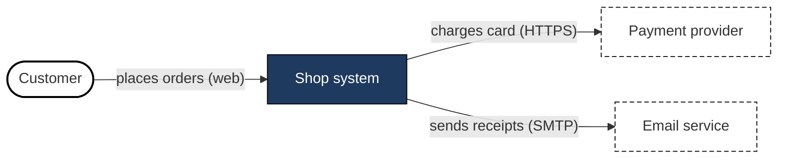
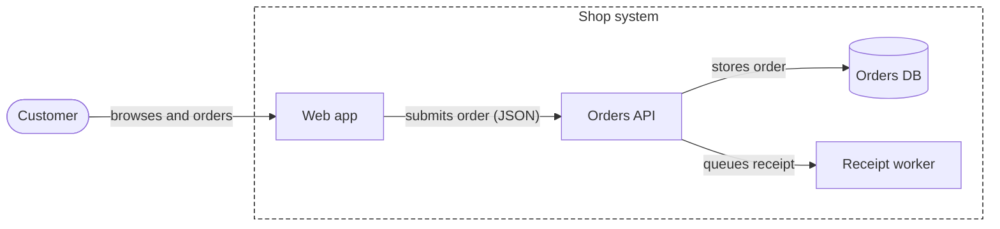
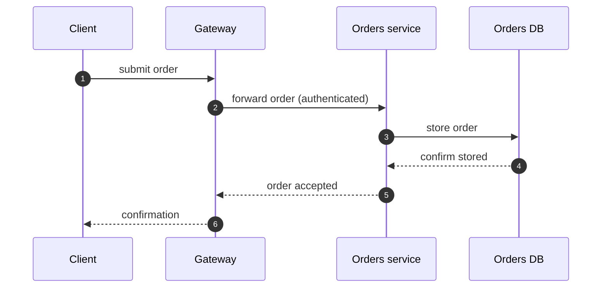
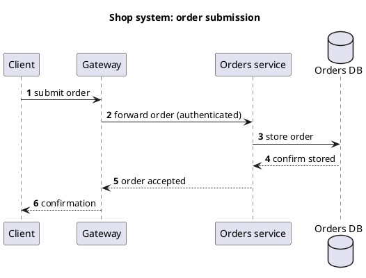

# Text diagrams: Mermaid, PlantUML, ASCII

The book's rules (see `diagrams-checklist.md`) were written for drawing tools. This file adapts them to diagrams that live as text in a repository. Everything below that names a Mermaid or PlantUML feature, an edge budget or a command is adaptation, not the book's claim; the underlying rule is cited. Check syntax against the version the project uses, since both tools change.

## Contents

1. Why text diagrams, and what you give up
2. Choosing the form
3. Mermaid practice
4. PlantUML practice
5. ASCII practice
6. Translating each antipattern into a text-diagram rule
7. Render and review procedure
8. Examples

## 1. Why text diagrams, and what you give up

Gains: diffable, reviewable in pull requests, one source embedded in many documents, editable by anyone with a text editor (Comm. Patterns ch. 11, "Share the Load": plain-text and open formats widen the pool of people who can maintain docs; ch. 10 DRY perspectives). Costs: automatic layout means you cannot route lines, set exact positions or control balance. The book's remedies that need hand placement (orthogonal connectors, line jumps, symmetry) are replaced here by fewer edges, better node ordering and splitting.

## 2. Choosing the form

| Need | Form | Why |
|---|---|---|
| System and its neighbours for a mixed audience | Flowchart as context diagram (system one node) | Readable by non-developers; Know Your Audience |
| Building blocks inside the system | Flowchart with one boundary subgraph | Container level; only the system in focus is a boundary |
| Order of calls and returns between participants | Sequence diagram with `autonumber` | Time order is the message; Match Flow to Expectations |
| States and transitions of one thing | State diagram | One entity, one message |
| Data model | ER diagram | Structural, technical readers |
| Process with decisions | Flowchart `TD` | Sequential relationship |
| Exact numbers over categories | Table, not a diagram | Precise values read better in tables (ch. 10) |
| Hierarchy or taxonomy | Indented list or tree | Hierarchical relationship |
| Chart of a trend | Real chart (matplotlib etc.) with zero baseline and takeaway headline | Misleading Composition |

If the audience needs UML and a legend, say so; otherwise default to labelled boxes and plain-language sequence messages (Using UML for UML's Sake).

## 3. Mermaid practice

Principles first: one level per diagram, one message per diagram, short verb-phrase edge labels, categories by `classDef` with a shape or line difference as well as colour.

### Skeleton: context diagram



Why: the person is a stadium shape, the system is dark with light text, external systems are dashed, so greyscale still separates them (Relying on Color). `accTitle` and `accDescr` give assistive technology a title and description (adaptation of the book's alt-text advice; confirm the project's Mermaid version supports them).

### Skeleton: container diagram of the same system



The subgraph label repeats the node name from the context diagram: that is the Representational Consistency link. The boundary appears only for the system in focus, drawn dashed with no fill as the book's C4 boundary is; the single `style` line on the subgraph is the one allowed exception to "no per-node style lines" below.

### Skeleton: sequence diagram



Why: participants declared in call order so requests run left to right and returns come back right to left; solid arrows for requests, dashed for returns; descriptive messages rather than method names, which age fast. Do not merge each request and return pair into one double arrow.

### Mermaid rules of thumb

- Direction: `LR` for request/response pipelines, `TB` for layers or hierarchies. Declare nodes in reading order, actor first.
- Categories: define `classDef` once per category, apply with `:::name`. Avoid per-node `style` lines (colour per component is the rainbow antipattern).
- Shapes carry meaning: `[(name)]` for stores, `([name])` for people or entry points, `[name]` for services, `{name}` for decisions. Document them in the legend.
- Edge labels: always. Quote the label text (`-->|"text"|`) so punctuation does not break parsing.
- Nesting: at most one level of subgraph for the boundary. Express region or account as part of a label, not as a box.
- Legend: add a small markdown table under the diagram listing shapes, line styles and colours. A "Legend" subgraph in the graph itself is possible but adds clutter and edges.
- Cross-cutting concerns (logging, metrics, auth) get their own diagram or a note line, not 15 arrows from every node.
- Notes: keep node text under about five words (inferred); put detail in a numbered list below the diagram and reference `[1]`.
- Large graphs: split by concern or level. Treat about 10 to 15 edges as the signal to split (inferred).
- Mermaid also has C4 diagram types (`C4Context`, `C4Container`); they may be experimental or limited in layout control depending on version, so verify in the project's version and otherwise use the flowchart forms above.

## 4. PlantUML practice

- Start with a `title`, and for structure diagrams choose one level. Prefer `skinparam linetype ortho` for right-angle connectors where the layout engine permits, which is the closest to the book's orthogonal-connector advice; check the output because ortho can make labels collide.
- Legends: `legend right ... end legend` with a short table of line styles and shapes.
- Use stereotypes (`<<queue>>`, `<<external>>`) and shapes, not only colour, to separate categories.
- Sequence diagrams: declare `participant` lines in call order; use `autonumber`; use `->` for requests and `-->` for returns; write plain-language messages.
- Icons or sprites: only in addition to the text label (Using Icons to Convey Meaning).
- Include shared definitions from one file (`!include`) so a node name is defined once across context and container diagrams; this serves DRY and name consistency.



## 5. ASCII practice

Use ASCII when the diagram must live in source comments, a terminal answer or a plain-text README.

- Width: keep under about 80 to 100 columns (inferred) so it survives narrow viewers.
- One level, one message, as with any diagram. Draw boxes with `+--+` and `|`; use `-->` for requests and `<--` on a separate line for returns, not a single `<-->`.
- Label every arrow: put the verb phrase above or beside the line.
- Differences by shape and character, not by colour: `[ ]` service, `( )` person, `{ }` store, `. .` or `- -` for external or optional paths.
- Add a `Key:` line for any symbol that is not obvious.
- Number steps `(1)`, `(2)` in reading order, top-left start.
- Always use a monospaced code fence. Do not rely on tabs.

```text
 Customer --(1 places order)--> [Web app] --(2 submits JSON)--> [Orders API]
                                                                  |
                                              (3 stores order)    v
                                                              {Orders DB}
 Key: ( ) person   [ ] service   { } data store   (n) step order
```

If you need more than about ten boxes, move to Mermaid or PlantUML and split.

## 6. Translating each antipattern into a text-diagram rule

| Antipattern or pattern (book) | Text-diagram rule |
|---|---|
| Mixing Levels of Abstraction | Never put a node next to its own parts; separate context and container sources |
| Representational Consistency | Same names and IDs in every file; boundary label equals the parent node name |
| Color Overload | At most four or five `classDef` categories, each listed in a legend |
| Boxes in Boxes | One boundary subgraph at most; use labels for region, account, network |
| Relationship Spiderweb | Edge budget about 10 to 15; remove cross-cutting nodes; one dominant direction |
| Balance Text | Node text about five words; details in a numbered list under the diagram |
| Relying on Color | Shape or line style or stereotype in addition to colour |
| Include a Legend | Legend table or block under or inside every non-trivial diagram |
| Appropriate Labels | Every edge labelled with a verb phrase; technology in parentheses |
| Big Picture First | Context diagram first in the document; detailed diagrams later |
| Match Flow to Expectations | `LR` or `TB` chosen on purpose; participants in call order; `autonumber` |
| Clear Relationships | One-way edges; dashed return edges; no `<-->` over two distinct messages |
| Icons | Text name always present |
| UML for UML's Sake | Plain-language messages unless UML is requested |
| Mixing Behavior and Structure | Component diagram and sequence diagram as separate sources |
| Illegible Diagrams | Narrow, split instead of shrinking; export landscape |
| Misleading Composition | Zero baselines for charts; equal node sizes; "1-3 instances (autoscaled)" |

## 7. Render and review procedure

1. Render: `mmdc -i diagram.mmd -o diagram.svg` for Mermaid (mermaid-cli), or the project's docs build; `plantuml diagram.puml` for PlantUML. If the tool is not installed, say the diagram is unrendered and name what you checked by reading the source.
2. Inspect the rendered output: no overlapping labels, no truncated text, readable at the display size.
3. Count: categories, edges, nesting depth, longest label.
4. Greyscale test: for each `classDef`, name its shape or line-style difference. If two categories differ only by hue, change one.
5. Reading-order test: narrate the diagram aloud.
6. Consistency: grep node names across related diagram files; names must match.
7. Place it in the document under a caption "Figure N: ..." and reference it by label in the text.

## 8. Examples

Fixing a spiderweb (adaptation): a flowchart with eight services, each linked to Logging, Metrics and Auth gives 24 cross edges. Remove those three nodes, add a note "All services emit logs and metrics and call Auth; see Figure 5", and the remaining flow shows request order.

Fixing mixed levels: a graph with "Billing" and "Billing API", "Billing DB" as siblings becomes a context view (Billing as one node) and a container view (Billing as a boundary with API and DB inside).
